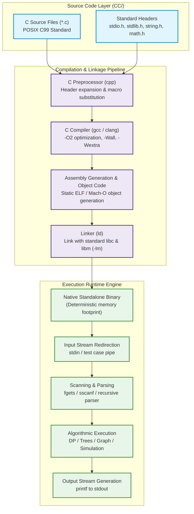
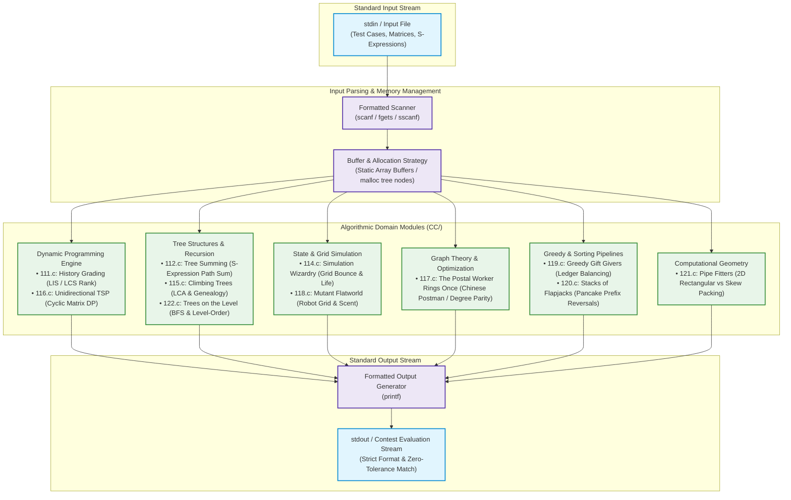

# C Algorithmic Survival Guide & Reference


A curated reference repository of robust, idiomatic C implementations solving classic foundational computational challenges from the **UVa Online Judge (Volume 1)**. The solutions emphasize deterministic execution, strict time and memory bounds, low overhead static allocation, and standards-compliant POSIX C programming.

---

## Architectural Blueprints

### 1. Algorithmic Problem Taxonomy & Pipeline Overview (ASCII)

```
========================================================================================
                     C ALGORITHMIC SURVIVAL GUIDE & REFERENCE
========================================================================================

   [ Contest / Test Input Stream ]
                 │
                 ▼ (stdin / pipes)
   ┌────────────────────────────────────────────────────────────────────────────────┐
   │                       INPUT PARSING & BUFFER ENGINE                            │
   │  • fgets / sscanf / scanf               • Fixed-size static line buffers       │
   │  • S-expression parser (112.c)          • BFS path decoder (122.c)             │
   └───────────────────────────────────────┬────────────────────────────────────────┘
                                           │
         ┌─────────────────────────────────┼─────────────────────────────────┐
         ▼                                 ▼                                 ▼
┌──────────────────┐             ┌──────────────────┐             ┌──────────────────┐
│   DYNAMIC PROG   │             │  TREE STRUCTURES │             │  GRID SIMULATION │
│  & OPTIMIZATION  │             │   & RECURSION    │             │   & AUTOMATA     │
├──────────────────┤             ├──────────────────┤             ├──────────────────┤
│ 111: History     │             │ 112: Path Sum    │             │ 114: Pinball     │
│      Grading LIS │             │      Tree Parser │             │      Grid Bumper │
│ 116: Unidirect   │             │ 115: Genealogy   │             │ 118: Flatworld   │
│      TSP Wrap DP │             │      Tree / LCA  │             │      Robot Nav   │
└────────┬─────────┘             │ 122: Level-order │             └────────┬─────────┘
         │                       │      BFS Tree    │                      │
         │                       └────────┬─────────┘                      │
         │                                │                                │
         ├────────────────────────────────┼────────────────────────────────┤
         ▼                                ▼                                ▼
┌──────────────────┐             ┌──────────────────┐             ┌──────────────────┐
│   GRAPH THEORY   │             │ GREEDY & SORTING │             │  COMPUTATIONAL   │
│ & EULERIAN PATHS │             │    ALGORITHMS    │             │     GEOMETRY     │
├──────────────────┤             ├──────────────────┤             ├──────────────────┤
│ 117: Chinese     │             │ 119: Gift Givers │             │ 121: Pipe Fit    │
│      Postman     │             │      Accounting  │             │      Circle Pack │
│      Shortest Pth│             │ 120: Flapjacks   │             │      Rect vs Skew│
│      Odd Parity  │             │      Pancake Sort│             │      Triangular  │
└────────┬─────────┘             └────────┬─────────┘             └────────┬─────────┘
         │                                │                                │
         └────────────────────────────────┼────────────────────────────────┘
                                          │
                                          ▼
   ┌────────────────────────────────────────────────────────────────────────────────┐
   │                          STANDALONE POSIX C TOOLCHAIN                          │
   │  • gcc -O2 -Wall -std=c99 -lm CC/<file>.c -o CC/<file>.out                     │
   │  • Zero runtime dependencies           • Deterministic memory & execution      │
   └───────────────────────────────────────┬────────────────────────────────────────┘
                                           │
                                           ▼ (stdout)
                          [ Verified Result Stream ]
========================================================================================
```

---

### 2. C Compilation & Execution Pipeline Flowchart (Mermaid)



---

### 3. Algorithmic Domain Taxonomy & Problem Solutions



---

## Problem Catalog & Taxonomy Index

| Problem File | UVa # | Problem Name | Domain / Algorithmic Paradigm | Key Technique / Data Structure |
| :--- | :--- | :--- | :--- | :--- |
| `CC/111.c` | 111 | History Grading | Dynamic Programming | Longest Increasing Subsequence (LIS) on permutation rank |
| `CC/112.c` | 112 | Tree Summing | Tree Structures & Parsing | Recursive descent parser for nested S-expression syntax |
| `CC/114.c` | 114 | Simulation Wizardry | Discrete Grid Simulation | State automata, bumper collision physics & lifetime tracking |
| `CC/115.c` | 115 | Climbing Trees | Tree & Graph Theory | Genealogy tree resolution & Lowest Common Ancestor (LCA) |
| `CC/116.c` | 116 | Unidirectional TSP | Dynamic Programming | $M \times N$ matrix DP with boundary wrapping & lexicographical tie-breaking |
| `CC/117.c` | 117 | The Postal Worker Rings Once | Graph Theory & Optimization | Eulerian circuit parity check & Chinese Postman shortest path |
| `CC/118.c` | 118 | Mutant Flatworld Explorers | Simulation & Navigation | Grid-bound robot orientation automata with scent boundary flags |
| `CC/119.c` | 119 | Greedy Gift Givers | Transaction Simulation | String participant lookup table & ledger accounting |
| `CC/120.c` | 120 | Stacks of Flapjacks | Greedy Sorting | Pancake sorting using dual-flip prefix reversals |
| `CC/121.c` | 121 | Pipe Fitters | Computational Geometry | 2D circular cross-section packing (rectangular vs equilateral triangular skew) |
| `CC/122.c` | 122 | Trees on the level | Binary Trees & Traversal | Tree reconstruction from `(val, path)` syntax & BFS level-order queue |

---

## POSIX C Toolchain & Technology Stack

| Layer / Category | Technology / Standard | Specification / Purpose |
| :--- | :--- | :--- |
| **Source Language** | C (ISO/IEC 9899:1999) | C99 standard ensuring broad compatibility with competitive programming judges |
| **Compiler Toolchain** | GCC / Clang | Clang 14+ / GCC 9+ with optimization flags (`-O2 -Wall -Wextra`) |
| **Runtime Libraries** | POSIX Standard C (`libc`) | `<stdio.h>`, `<stdlib.h>`, `<string.h>`, `<stdbool.h>` |
| **Math Engine** | C Math Library (`libm`) | `<math.h>` linked via `-lm` for computational geometry calculations |
| **Memory Strategy** | Static & Scoped Dynamic | Static buffers for $O(1)$ allocation; heap `malloc`/`free` for dynamic tree structures |
| **I/O Architecture** | Fast Standard Stream | Buffered stream scanning with `fgets`, `sscanf`, and formatted `printf` |
| **Platform Target** | POSIX Compliant OS | macOS (Darwin), Linux, BSD, and Windows MinGW/WSL |

---

## Build & Execution Instructions

### Compilation
Compile any problem solution using standard optimization flags:

```bash
# General compilation pattern
gcc -O2 -Wall -std=c99 CC/<problem>.c -lm -o CC/<problem>.out

# Example: Compile UVa 116 (Unidirectional TSP)
gcc -O2 -Wall -std=c99 CC/116.c -lm -o CC/116.out
```

### Execution
Run the compiled binary with standard input redirection:

```bash
# Execute with input file
./CC/116.out < input.txt

# Or execute interactively via stdin
./CC/116.out
```
